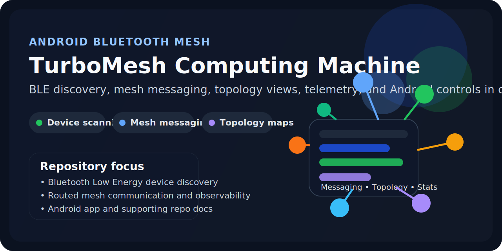
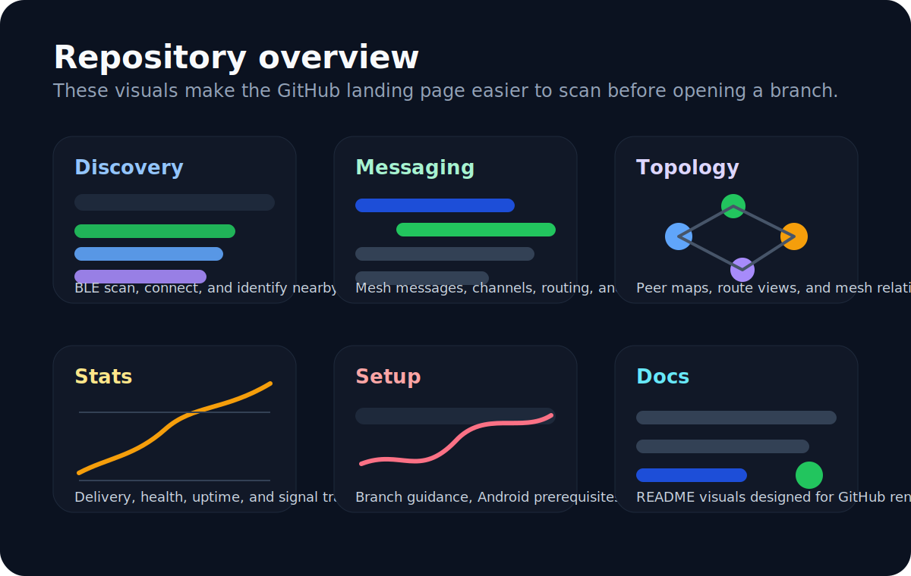
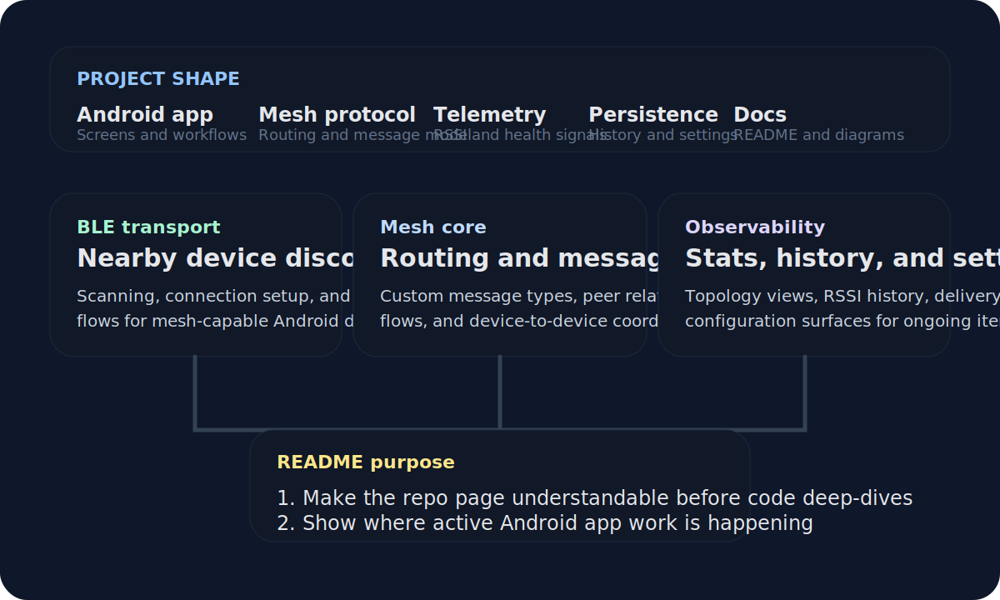

# TurboMesh Computing Machine

> A comprehensive Android application for Bluetooth Mesh networking with custom mesh messaging capabilities.

[](LICENSE)
[](https://developer.android.com)
[](https://android-arsenal.com/api?level=23)

<p align="center">
  
</p>

**turbomesh-computing-machine** enables seamless communication between BLE (Bluetooth Low Energy) devices using advanced mesh networking protocols. It provides a robust framework for device discovery, pairing, and message routing across multi-hop Bluetooth Mesh networks.

---

## Table of Contents

1. [Features](#features)
2. [Quick Visual Overview](#quick-visual-overview)
3. [Architecture](#architecture)
4. [Quickstart / Installation](#quickstart--installation)
5. [Usage](#usage)
6. [Configuration](#configuration)
7. [Development](#development)
8. [Project Structure](#project-structure)
9. [Contributing](#contributing)
10. [License](#license)

---

## Features

- **Bluetooth Mesh Networking** – Implements the Bluetooth Mesh Profile specification for multi-hop, many-to-many communication.
- **Device Discovery** – Automatically scans and discovers nearby BLE-capable devices and mesh nodes.
- **Device Pairing & Provisioning** – Guided provisioning flow to add new nodes to the mesh network.
- **Custom Mesh Messaging** – Send and receive application-level messages across the mesh using configurable models and addresses.
- **Message Routing** – Intelligent relay and forwarding logic that maximises delivery reliability.
- **Node Management** – View network topology, monitor node health, and remove nodes from the mesh.
- **Persistent Configuration** – Stores network keys, application keys, and node addresses across app restarts.

---

## Quick Visual Overview

<p align="center">
  
</p>

---

## Architecture

<p align="center">
  
</p>

---

## Quickstart / Installation

### Prerequisites

| Requirement | Version |
|-------------|---------|
| Android Studio | Hedgehog (2023.1.1) or newer |
| Android SDK | API level 23 (Android 6.0) or higher |
| JDK | 17 or newer |
| A physical Android device | Bluetooth 4.0+ (BLE required) |

> **Note:** Bluetooth Mesh features require a physical device; the Android Emulator does not support BLE hardware.

### Clone the repository

```bash
git clone https://github.com/gdev6145/turbomesh-computing-machine.git
cd turbomesh-computing-machine
```

### Build and install (command line)

```bash
# Debug build
./gradlew assembleDebug

# Install on a connected device
./gradlew installDebug
```

### Build and install (Android Studio)

1. Open Android Studio and choose **File → Open**, then select the project directory.
2. Wait for Gradle sync to finish.
3. Connect your Android device via USB and enable **USB Debugging** in Developer Options.
4. Click **Run ▶** (or press `Shift+F10`).

---

## Usage

### Launching the app

After installation, open **TurboMesh** from your device's app drawer.

### Scanning for devices

1. Tap **Scan** on the home screen to start a Bluetooth Mesh scan.
2. Discovered unprovisioned nodes appear in the device list.

### Provisioning a node

1. Select an unprovisioned device from the scan results.
2. Follow the on-screen provisioning wizard to assign the node a unicast address and distribute network/application keys.
3. The node moves to the **Provisioned Nodes** list once complete.

### Sending a mesh message

```
Home → Provisioned Nodes → [select node] → Send Message → enter payload → Send
```

### Removing a node

```
Provisioned Nodes → [long-press node] → Reset Node
```

---

## Configuration

### Android permissions

The following permissions are declared in `AndroidManifest.xml` and are required at runtime on Android 12+:

| Permission | Purpose |
|------------|---------|
| `BLUETOOTH_SCAN` | Scan for nearby BLE devices |
| `BLUETOOTH_CONNECT` | Connect to and communicate with BLE devices |
| `BLUETOOTH_ADVERTISE` | Advertise as a BLE device / mesh node |
| `ACCESS_FINE_LOCATION` | Required for BLE scanning on API < 31 |

### Environment / build configuration

Build variants and signing configurations are defined in `app/build.gradle`. Key properties you may override in `local.properties` or via environment variables:

| Property | Description | Default |
|----------|-------------|---------|
| `MESH_NETWORK_KEY` | 128-bit network key (hex) | Generated at first run |
| `MESH_APP_KEY` | 128-bit application key (hex) | Generated at first run |
| `MESH_IV_INDEX` | Initial IV Index for the mesh network | `0` |

> **TODO:** Update this table once a concrete `local.properties` / secrets setup is finalised.

---

## Development

### Set up the development environment

```bash
# Clone and enter the repo
git clone https://github.com/gdev6145/turbomesh-computing-machine.git
cd turbomesh-computing-machine

# Sync Gradle dependencies (no device required)
./gradlew dependencies
```

### Lint

```bash
./gradlew lint
```

HTML lint report is written to `app/build/reports/lint-results-debug.html`.

### Unit tests

```bash
./gradlew test
```

### Instrumented (on-device) tests

```bash
./gradlew connectedAndroidTest
```

> A physical device or emulator with API 23+ must be connected.

### Build release APK

```bash
./gradlew assembleRelease
```

> Sign the release build with your keystore before distributing. See the [Android signing documentation](https://developer.android.com/studio/publish/app-signing) for details.

---

## Project Structure

```
turbomesh-computing-machine/
├── app/
│   ├── src/
│   │   ├── main/
│   │   │   ├── java/          # Kotlin / Java source files
│   │   │   ├── res/           # Layouts, drawables, strings, etc.
│   │   │   └── AndroidManifest.xml
│   │   ├── test/              # JVM unit tests
│   │   └── androidTest/       # Instrumented tests
│   └── build.gradle           # App-level Gradle config
├── docs/
│   └── images/                # SVG assets for the repo landing page
├── gradle/
│   └── wrapper/               # Gradle wrapper files
├── build.gradle               # Project-level Gradle config
├── settings.gradle
├── CONTRIBUTING.md
├── CODE_OF_CONDUCT.md
├── SECURITY.md
├── LICENSE
└── README.md
```

---

## Contributing

Contributions are welcome! Please read [CONTRIBUTING.md](CONTRIBUTING.md) for guidelines on how to:

- Report bugs
- Request features
- Submit pull requests
- Follow the code style

All participants are expected to abide by the [Code of Conduct](CODE_OF_CONDUCT.md).

---

## License

This project is licensed under the **MIT License** – see the [LICENSE](LICENSE) file for details.

Copyright © 2026 Silas Malone
