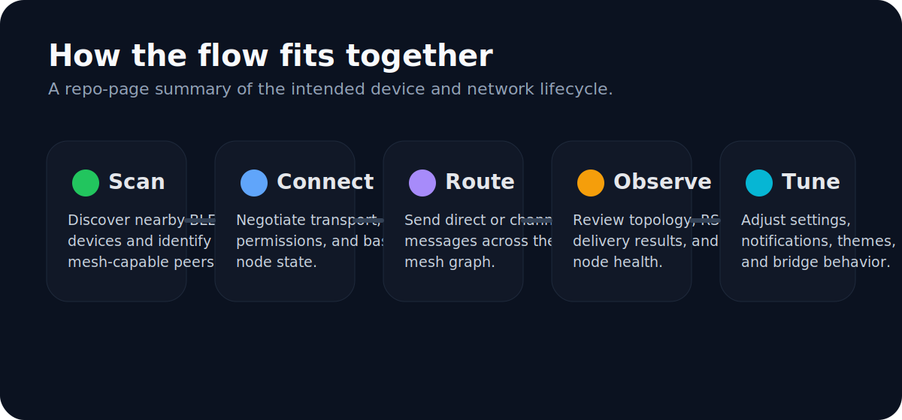
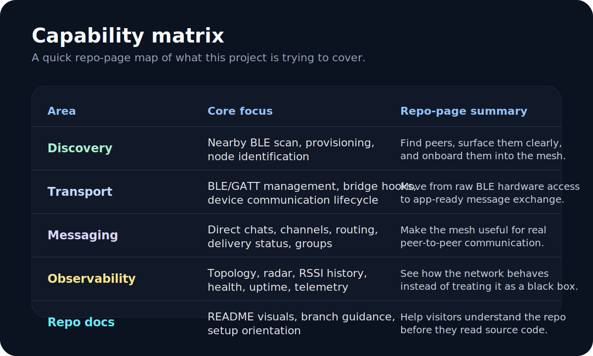
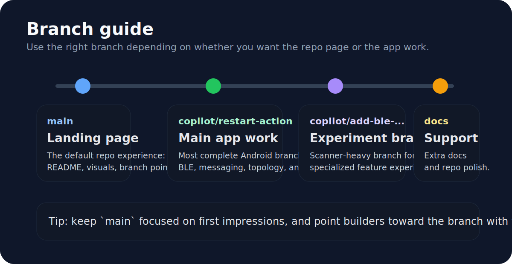
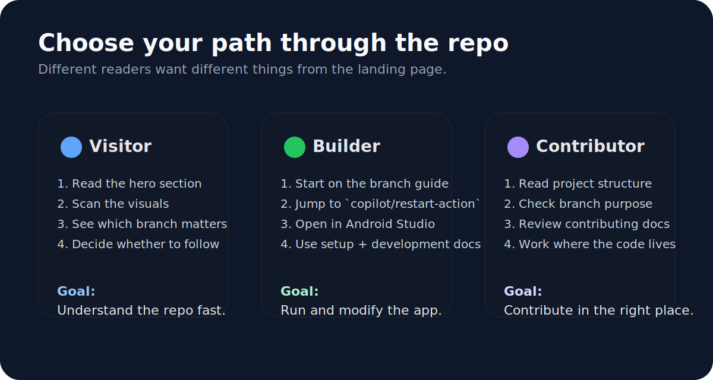
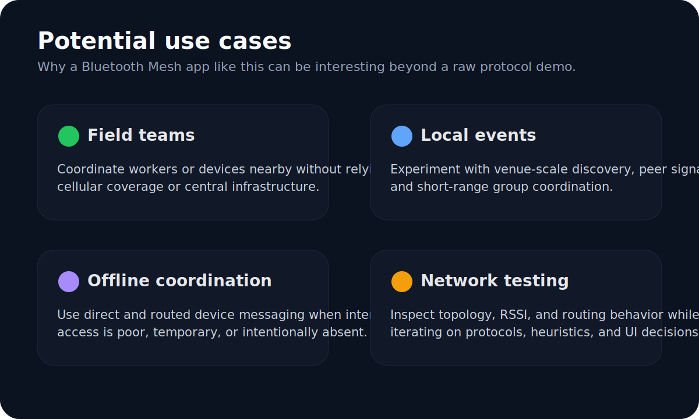
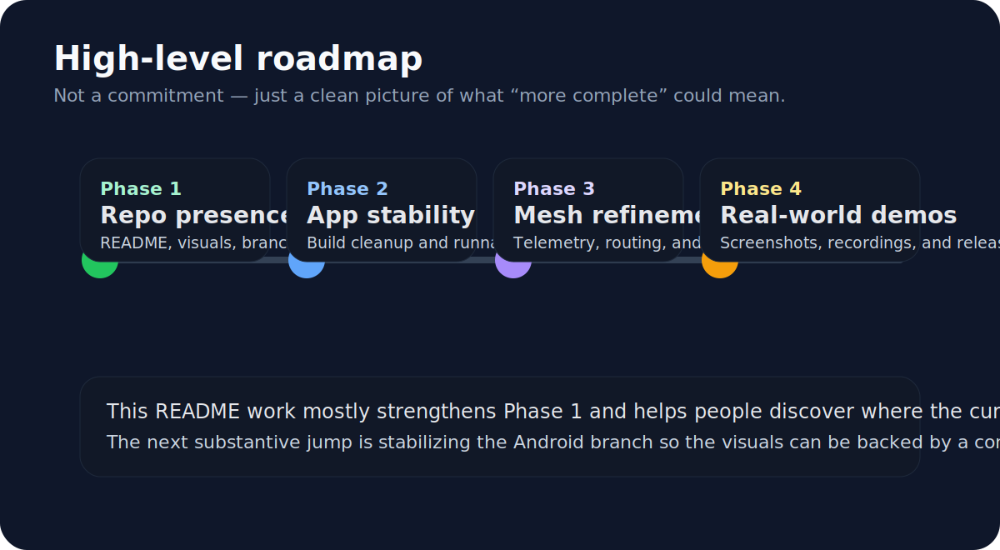
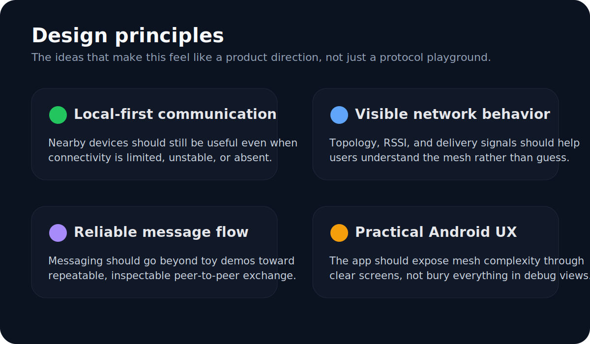
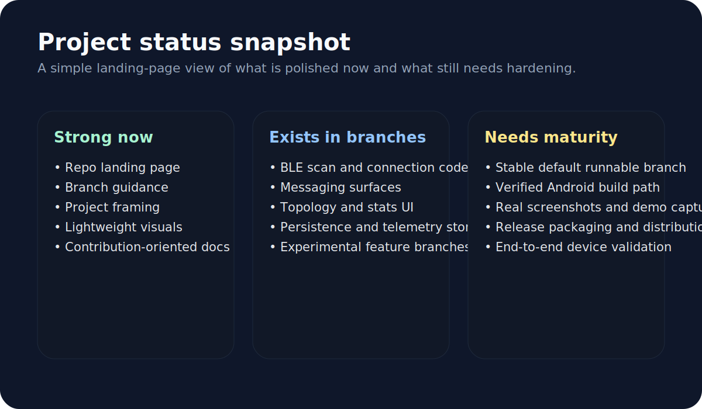

# TurboMesh Computing Machine

> A comprehensive Android application for Bluetooth Mesh networking with custom mesh messaging capabilities.

[](LICENSE)
[](https://developer.android.com)
[](https://android-arsenal.com/api?level=23)

<p align="center">
  
</p>

**turbomesh-computing-machine** enables seamless communication between BLE (Bluetooth Low Energy) devices using advanced mesh networking protocols. It provides a robust framework for device discovery, pairing, and message routing across multi-hop Bluetooth Mesh networks.

<p align="center">
  
  
  
</p>

---

## What this repo is about

- **BLE discovery and connection management**
- **Custom mesh message routing and channel workflows**
- **Topology, radar, RSSI history, and delivery stats**
- **Android-first UX for observing and tuning the network**

## Table of Contents

1. [Features](#features)
2. [Quick Visual Overview](#quick-visual-overview)
3. [Architecture](#architecture)
4. [Mesh Lifecycle](#mesh-lifecycle)
5. [Capability Matrix](#capability-matrix)
6. [Branch Guide](#branch-guide)
7. [Repo Journeys](#repo-journeys)
8. [Use Cases](#use-cases)
9. [Roadmap](#roadmap)
10. [Design Principles](#design-principles)
11. [Project Status](#project-status)
12. [Quickstart / Installation](#quickstart--installation)
13. [Usage](#usage)
14. [Configuration](#configuration)
15. [Development](#development)
16. [Project Structure](#project-structure)
17. [Contributing](#contributing)
18. [License](#license)

---

## Features

- **Bluetooth Mesh Networking** – Implements the Bluetooth Mesh Profile specification for multi-hop, many-to-many communication.
- **Device Discovery** – Automatically scans and discovers nearby BLE-capable devices and mesh nodes.
- **Device Pairing & Provisioning** – Guided provisioning flow to add new nodes to the mesh network.
- **Custom Mesh Messaging** – Send and receive application-level messages across the mesh using configurable models and addresses.
- **Message Routing** – Intelligent relay and forwarding logic that maximises delivery reliability.
- **Node Management** – View network topology, monitor node health, and remove nodes from the mesh.
- **Persistent Configuration** – Stores network keys, application keys, and node addresses across app restarts.

---

## Quick Visual Overview

<p align="center">
  
</p>

---

## Architecture

<p align="center">
  
</p>

---

## Mesh lifecycle

<p align="center">
  
</p>

---

## Capability matrix

<p align="center">
  
</p>

| Area | Why it matters |
| --- | --- |
| Discovery | A mesh app is only useful if nearby peers can be found and identified reliably. |
| Transport | BLE/GATT lifecycle management is the layer everything else depends on. |
| Messaging | The repo aims beyond scanning into practical peer-to-peer communication. |
| Observability | Topology, RSSI, and delivery insights make the network debuggable. |
| Repo docs | The landing page should explain where to go before people read code. |

---

## Branch guide

<p align="center">
  
</p>

The default branch is now a cleaner landing page. The more substantial implementation work currently lives on active branches:

| Branch | Purpose |
| --- | --- |
| `main` | GitHub landing page, README, and repo-facing visuals |
| `copilot/restart-action` | Most complete Android app branch with BLE, messaging, topology, stats, and settings work |
| `copilot/add-ble-mesh-article-scanner` | Experimental BLE/article scanner branch |
| `copilot/update-readme-and-add-docs` | Supplemental documentation branch |

---

## Repo journeys

<p align="center">
  
</p>

If you're just browsing, stay on `main`. If you're trying to run or extend the Android app, jump straight to `copilot/restart-action`. If you're helping on docs, stay close to the repo-facing branches and README assets.

---

## Use cases

<p align="center">
  
</p>

| Scenario | Why mesh helps |
| --- | --- |
| Field teams | Nearby devices can coordinate without depending on cellular infrastructure. |
| Local events | A short-range mesh is useful for experimentation and venue-scale coordination. |
| Offline coordination | Devices can exchange information even when internet access is limited or unavailable. |
| Network testing | Topology and RSSI surfaces help evaluate routing and signal behavior in practice. |

---

## Roadmap

<p align="center">
  
</p>

Right now the repo-page work improves discovery and sets expectations. The next major leap is turning the most complete Android branch into a reliably runnable baseline, then backing the README with real screenshots and demos.

---

## Design principles

<p align="center">
  
</p>

| Principle | Why it matters |
| --- | --- |
| Local-first communication | Nearby devices should still be useful when the internet is weak or unavailable. |
| Visible network behavior | The app should expose topology and signal state instead of hiding mesh behavior. |
| Reliable message flow | Messaging needs delivery-oriented thinking, not just raw packet exchange. |
| Practical Android UX | Real users need understandable screens, not only debugging tools. |

---

## Project status

<p align="center">
  
</p>

The repo page is now comparatively polished, and the implementation branches already contain substantial Android work. The biggest gap is still turning that branch work into a stable, easy-to-run baseline with real screenshots and repeatable build validation.

---

## Quickstart / Installation

### Prerequisites

| Requirement | Version |
|-------------|---------|
| Android Studio | Hedgehog (2023.1.1) or newer |
| Android SDK | API level 23 (Android 6.0) or higher |
| JDK | 17 or newer |
| A physical Android device | Bluetooth 4.0+ (BLE required) |

> **Note:** Bluetooth Mesh features require a physical device; the Android Emulator does not support BLE hardware.

### Clone the repository

```bash
git clone https://github.com/gdev6145/turbomesh-computing-machine.git
cd turbomesh-computing-machine
```

### Build and install (command line)

```bash
# Debug build
./gradlew assembleDebug

# Install on a connected device
./gradlew installDebug
```

### Build and install (Android Studio)

1. Open Android Studio and choose **File → Open**, then select the project directory.
2. Wait for Gradle sync to finish.
3. Connect your Android device via USB and enable **USB Debugging** in Developer Options.
4. Click **Run ▶** (or press `Shift+F10`).

---

## Usage

### Launching the app

After installation, open **TurboMesh** from your device's app drawer.

### Scanning for devices

1. Tap **Scan** on the home screen to start a Bluetooth Mesh scan.
2. Discovered unprovisioned nodes appear in the device list.

### Provisioning a node

1. Select an unprovisioned device from the scan results.
2. Follow the on-screen provisioning wizard to assign the node a unicast address and distribute network/application keys.
3. The node moves to the **Provisioned Nodes** list once complete.

### Sending a mesh message

```
Home → Provisioned Nodes → [select node] → Send Message → enter payload → Send
```

### Removing a node

```
Provisioned Nodes → [long-press node] → Reset Node
```

---

## Configuration

### Android permissions

The following permissions are declared in `AndroidManifest.xml` and are required at runtime on Android 12+:

| Permission | Purpose |
|------------|---------|
| `BLUETOOTH_SCAN` | Scan for nearby BLE devices |
| `BLUETOOTH_CONNECT` | Connect to and communicate with BLE devices |
| `BLUETOOTH_ADVERTISE` | Advertise as a BLE device / mesh node |
| `ACCESS_FINE_LOCATION` | Required for BLE scanning on API < 31 |

### Environment / build configuration

Build variants and signing configurations are defined in `app/build.gradle`. Key properties you may override in `local.properties` or via environment variables:

| Property | Description | Default |
|----------|-------------|---------|
| `MESH_NETWORK_KEY` | 128-bit network key (hex) | Generated at first run |
| `MESH_APP_KEY` | 128-bit application key (hex) | Generated at first run |
| `MESH_IV_INDEX` | Initial IV Index for the mesh network | `0` |

> **TODO:** Update this table once a concrete `local.properties` / secrets setup is finalised.

---

## Development

### Set up the development environment

```bash
# Clone and enter the repo
git clone https://github.com/gdev6145/turbomesh-computing-machine.git
cd turbomesh-computing-machine

# Sync Gradle dependencies (no device required)
./gradlew dependencies
```

### Lint

```bash
./gradlew lint
```

HTML lint report is written to `app/build/reports/lint-results-debug.html`.

### Unit tests

```bash
./gradlew test
```

### Instrumented (on-device) tests

```bash
./gradlew connectedAndroidTest
```

> A physical device or emulator with API 23+ must be connected.

### Build release APK

```bash
./gradlew assembleRelease
```

> Sign the release build with your keystore before distributing. See the [Android signing documentation](https://developer.android.com/studio/publish/app-signing) for details.

---

## Project Structure

```
turbomesh-computing-machine/
├── app/
│   ├── src/
│   │   ├── main/
│   │   │   ├── java/          # Kotlin / Java source files
│   │   │   ├── res/           # Layouts, drawables, strings, etc.
│   │   │   └── AndroidManifest.xml
│   │   ├── test/              # JVM unit tests
│   │   └── androidTest/       # Instrumented tests
│   └── build.gradle           # App-level Gradle config
├── docs/
│   └── images/                # SVG assets for the repo landing page
├── gradle/
│   └── wrapper/               # Gradle wrapper files
├── build.gradle               # Project-level Gradle config
├── settings.gradle
├── CONTRIBUTING.md
├── CODE_OF_CONDUCT.md
├── SECURITY.md
├── LICENSE
└── README.md
```

---

## Contributing

Contributions are welcome! Please read [CONTRIBUTING.md](CONTRIBUTING.md) for guidelines on how to:

- Report bugs
- Request features
- Submit pull requests
- Follow the code style

All participants are expected to abide by the [Code of Conduct](CODE_OF_CONDUCT.md).

---

## Repo-page assets

The images under `docs/images/` are SVGs so they render well on GitHub, stay lightweight in the repo, and can be edited or replaced with real screenshots later.

If you want the repo page to feel even more product-like later, the best follow-up is to add:

- real Android screenshots from the messaging, topology, and stats screens
- a short demo GIF of BLE discovery or message exchange
- release badges or APK links once the app branch is stabilized

---

## License

This project is licensed under the **MIT License** – see the [LICENSE](LICENSE) file for details.

Copyright © 2026 Silas Malone
